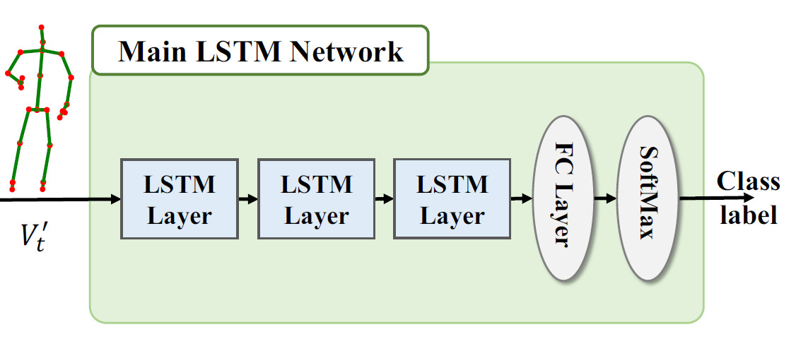

# Human-Action-Recognition-from-Skeleton-Data
A Simple But High-accuracy LSTM for human Action Recognition 


# Code structure
* [`matlab_m/`](matlab_m/): transform the given dataset(NTU RGB+D) to your need , from "*.skeleton" to "*.mat"
    * [`demo.m`](matlab_m/demo.m): an example for you to transform the dataset using the given functions .You shall verify the "fileFolder","dirOutput",and "savepath"
    * [`classfile.m`](matlab_m/classfile.m): divide the "*.mat" file according to their class.
    * [`read_skeleton_file.m`](matlab_m/read_skeleton_file.m): a function to read the skeleton files (given by NTU RGB dataset)
    * [`savetomat.m`](matlab_m/savetomat.m): a function to save the skeleton data from skeleton files to mat files
    * [`show_skeleton_on_depthmaps.m`](matlab_m/show_skeleton_on_depthmaps.m): a function to show the skeleton information on the depthmaps(thanks to the NTU RGB+D dataset)
    * [`show_skeleton_on_IR_frames.m`](matlab_m/show_skeleton_on_IR_frames.m): a function to show the skeleton information on the IR frames(thanks to the NTU RGB+D dataset)
    * [`show_skeleton_on_RGB_frames.m`](matlab_m/show_skeleton_on_RGB_frames.m): a function to show the skeleton information on the RGB frames(thanks to the NTU RGB+D dataset)
* [`lstm_py/`](lstm_py/): the train and test python file using tensorflow lib.
    * [`main.py`](lstm_py/main.py): the train python file using tensorflow.
    * [`evaluate.py`](lstm_py/evaluate.py): the test file to evaluate your model perfermance.
    * [`mtop.py`](lstm_py/mtop.py): transform the skeleton files form "*.mat" to "*.npy" for python files . Also, you may use it for seperate train and test set . 
    * [`model_lstm/`](lstm_py/model_lstm): well-trained model of lstm .
* [`keras`](keras): the train and test python file using keras lib.
    * [`main.py`](keras/main.py): an example for you to transform the dataset using the given functions .You shall verify the "train_file", and "tree_file"
# Requirements
* code only tested on linux system (ubuntu 16.04)
* Python 3 (Anaconda 3.6.3 specifically) with numpy and matplotlib
* Tensorflow
* keras
* matlab
# model structure

# To prepare using the given data by NTU RGB+D
In file [`demo.m`](matlab_m/demo.m)
```matlab
fileFolder=['D:\research\ntuRGB\ske_f\',num2str(t),'\'];%using your own dataset path
savepath=['D:\research\ntuRGB\mat_f\',num2str(t),'\'];%using your own save path
```
In file [`classfile.m`](matlab_m/classfile.m)
```matlab
SOURCE_PATH_t =[ 'D:\research\ntuRGB\mat_f\',num2str(i),'\'];%using your own "*.mat" files path  
DST_PATH_t1 = [ 'D:\research\ntuRGB\mat_f\',num2str(i),'\test'];%using your own wanted test set saved path
DST_PATH_t2 = [ 'D:\research\ntuRGB\mat_f\',num2str(i),'\train'];%using your own wanted train set saved path
```
```bash
matlab demo.m
matlab classfile.m
```
# To train
In file [`main.py`](lstm_py/main.py)
```python

train_file='CV_20/train' #verify your train data files forder here 
test_file='CV_20/test' #verify your train data files forder here 
model_file="model/my-model.meta"#verify your train model data file
model_path="model/"#verify your train model data folder
```
```bash
python lstm_py/main.py
```
* you will get your own model saved in the "model/"
# To test 
In file [`evaluate.py`](lstm_py/evaluate.py)
```python

train_file='CV_20/train' #verify your train data files forder here 
test_file='CV_20/test' #verify your train data files forder here 
model_file="model/my-model.meta"#verify your train model data file
model_path="model/"#verify your train model data folder
```
```bash
python lstm_py/evaluate.py
```


